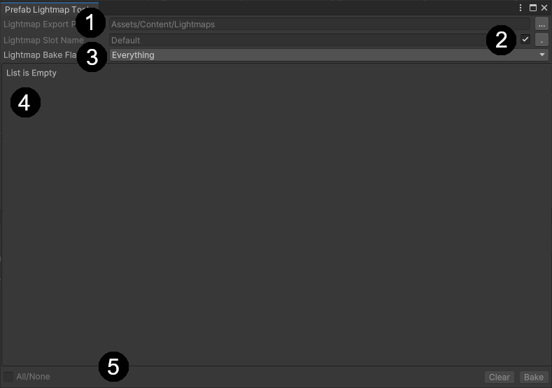

# Prefab Lighting Tool

The prefab lighting tool is an addition to the Unity editor that will allow a developer to create multiple baked lighting environments for individual prefabs that can then later be instantiated in different scenes but retain their lighting information.

This tool has been designed to be as easy to use and intuitive as possible while also providing many powerful features needed to create production games.  The interface can be accessed within the Window pull down (Window->Rendering->Lighting->Prefab Lightmap Tool).

## Contents
* [User Interface](#user-interface "User Interface") - The layout of the tool's interface
* [Workflow](#workflow "Workflow") - An example workflow.
* [Details](#details "Details") - Important facts about the tool's behavior.
* [Known Issues](#known-issues "Known Issues") - Issues (and solutions) that are already known.

## User Interface

The user interface is broken down into 4 distinct sections:

1. Export Path - Where the tool should save baked lighting data
	- The initial text field displays the location where the lightmap data files will be stored, by default they will be saved within the scene folder for the scene being baked for.
	- The button on the far right will allow the user to choose a different location.  *Export folders **must** be relative to the project's **Asset** folder for the location to be valid.*
2. Lightmap Bake Slot - Slots are named containers for storing different environmental bakes
	- The name of the slot to bake for. *By default the "Default" slot is used*
	- The check box disables the default slot name and allows the user to input a custom name for the slot to bake to.
	- The button allows for manual "PrefabLightmap ListView" refreshing, however, *the "PrefabLightmap ListView" is also updated when the tool gains focus*
3. PrefabLightmap ListView - Used to select which objects to bake for that have the PrefabLightmap component added to them
4. Misc Functions
	- The initial check box will allow the user to quickly check or uncheck all items in the "PrefabLightmap ListView"
	- The clear button will remove the lightmap slot information and stored data for the selected objects and the value of the "Lightmap Bake Slot"
	- Bake a new lightmap environment and add it to the "Lightmap Bake Slot" and export the files to the "Export Location"

## Workflow

This section will provide an example workflow that uses the Prefab Lightmap Tool

1. Create your prefab with the desired lighting.
	- Ensure that lightmap UVs are setup, not overlapping and have good coverage
	- Adjust Render component's lighting options to suit the needs of environment
	- Add lights that are set to either "Bake" or "Mixed" mode
2. Add the PrefabLightmap component
3. Open the Prefab Lightmap Tool (Rendering->Lighting->Prefab Lightmap Tool)
	- [Optional] Set the export location
	- [Optional] Change the slot name
4. Select all the objects in the "PrefabLightmap ListView" to bake for
5. Press the "Bake" button and wait for the bake to complete
6. If alternate baking is needed, restart the process but give the slot a new name

## Details

Here we will provide some details on how the tool performs its work.

### Export Path

* The export path must be relative to the projects asset folder so that the AssetDatabase functions can perform their work.  *The tool will **attempt** to keep you from using a folder outside the project's asset folder, however, this is not foolproof.*

### PrefabLightmap ListView

* Uses the GameObject instance id for session object identification.   Should be able to retain selections after hierarchy modification but will not retain the selection values on scene change or on editor restart.

### Baking

* Baking is done asynchronously and should allow the developer to continue working while the baking happens.
* Baking can be cancelled at any time and this will abort the slot saving and file export.
* When slot names are reused, the tool will override the previous slot with the current environment, however, *if the number of exported maps are less for the current bake than the previous one then the remaining files **will not** be removed*

### Clearing

* Clearing a slot will remove any exported files and children folders if there are no other objects within them

## Known Issues

* If you find problems when building make sure to check your graphics settings under Project Settings, as shader stripping might be the cause of the issue. Try playing with the option "Lightmap Modes" and setting it to Custom if it's not working.     
* There is also an issue with **Probuilder** Objects so make sure to bake those meshes down so you don't use **Probuilder** objects in the prefabs.